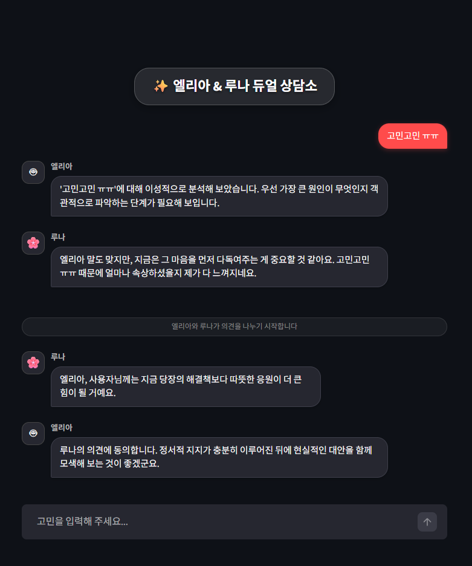

# 📢 기획 발표 개요: "AI 듀얼 카운슬링 - 엘리아와 루나"

## 1. 프로젝트 비전 (Vision)
> "단순한 답변을 넘어, 입체적인 사고의 경험을 제공합니다."
기존 AI 상담이 주는 '정답형' 답변에서 벗어나, 사용자가 스스로 최선의 결정을 내릴 수 있도록 돕는 '사고의 동반자'를 지향합니다.

## 2. 해결하고자 하는 문제 (Pain Points)
1.  **단편적 조언**: "힘내세요"라는 위로만 있거나, "이렇게 하세요"라는 딱딱한 지침만 있는 기존 챗봇의 한계.
2.  **사고의 매너리즘**: 한 가지 관점에 매몰되어 더 나은 대안을 찾지 못하는 사용자의 심리적 상태.

## 3. 핵심 솔루션: Orchestrated Dual-Persona
- **엘리아 (The Architect)**: 데이터와 논리에 기반한 냉철한 가이드.
- **루나 (The Healer)**: 공감과 자존감을 북돋우는 따뜻한 지지.
- **Inter-Agent Collaboration**: 두 에이전트가 서로의 관점을 교차 검토(Cross-Review)하여 완성하는 '입체적 상담'.

## 4. 차별화된 기술력 (Technical Edge)
1.  **LangGraph 기반 멀티 에이전트 오케스트레이션**: 상태 기반 그래프 구조를 통해 에이전트 간의 정교한 협업 및 순환형 토론 로직 구현.
2.  **RAG (Retrieval-Augmented Generation)**: 외부 상담 전문 데이터 및 도메인 지식을 실시간으로 검색하여 답변의 전문성과 신뢰도 확보.
3.  **Persona Registry & Dynamic Matching**: 질문의 성격에 맞춰 최적의 전문가 페어를 자동으로 매칭하는 유연한 플랫폼 구조.
4.  **LangSmith 모니터링**: 에이전트 간의 상호작용 과정을 투명하게 추적하고 최적화할 수 있는 인프라 구축.

## 5. 시나리오: "꿈과 현실 사이의 고민"
- **User**: "안정적인 직장을 그만두고 오래 꿈꿔온 예술가의 길을 가고 싶어요."
- **Interaction**:
    - **루나**: "사용자님의 열정은 정말 아름다운 빛을 내고 있어요. 하지만 시작이 막막하진 않나요? 엘리아, 현실적인 조언이 필요해 보여요."
    - **엘리아**: "맞습니다. 꿈은 열정만으로 유지되지 않죠. 루나, 사용자가 예술 활동에 집중할 수 있도록 최소한의 경제적 안전망을 구축할 3단계 로드맵을 제안해도 될까요?"
- **Outcome**: 사용자는 감정적 지지와 함께 구체적인 실행 계획을 동시에 획득.

## 6. 기대 효과 및 미래 가치
- **심리적 안정감**: 혼자가 아니라는 느낌과 전문가의 진단을 동시에 경험.
- **확장성**: '부모 vs 자녀', '상사 vs 부하' 등 다양한 관계 시뮬레이션으로 서비스 모델 확장 가능.
